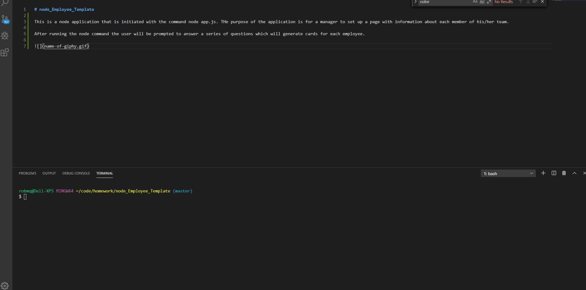

# node_Employee_Template

This is a node application that is initiated with the command node app.js. THe purpose of the application is for a manager to set up a page with information about each member of his/her team.

After running the node command the user will be prompted to answer a series of questions which will generate cards for each employee.

